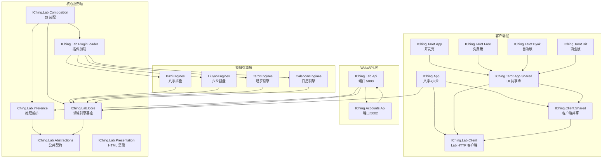
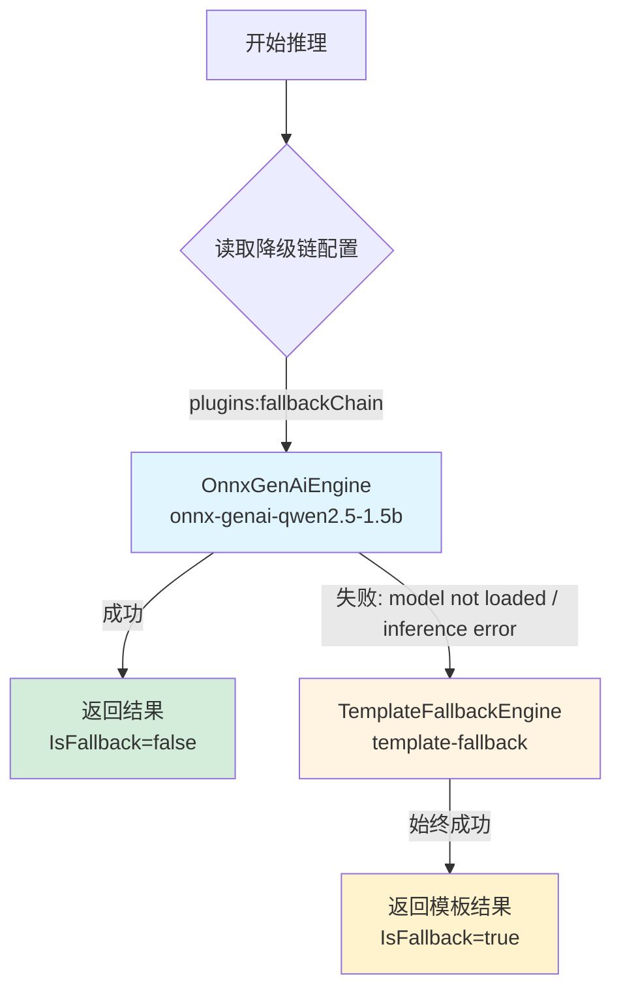
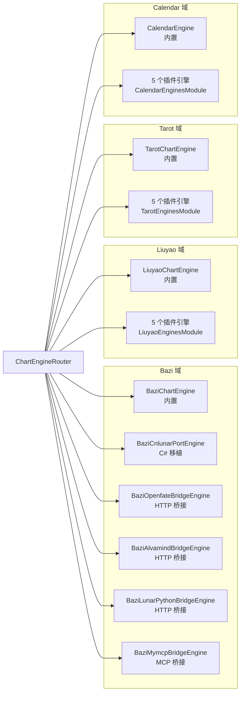
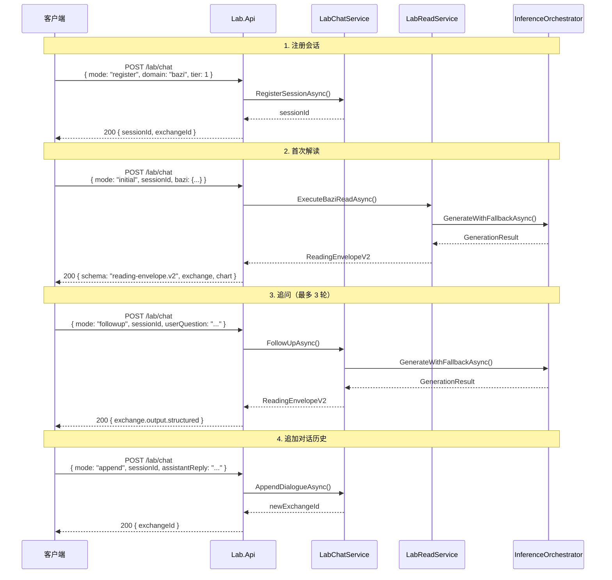
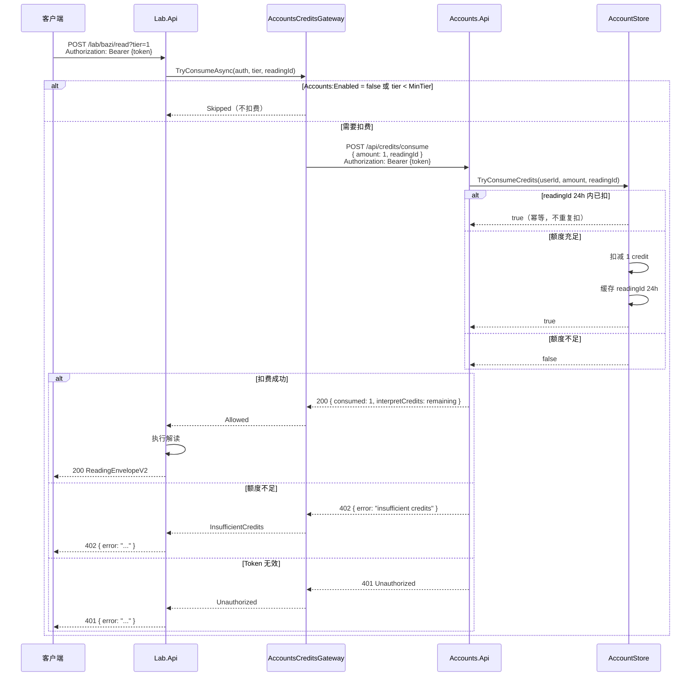
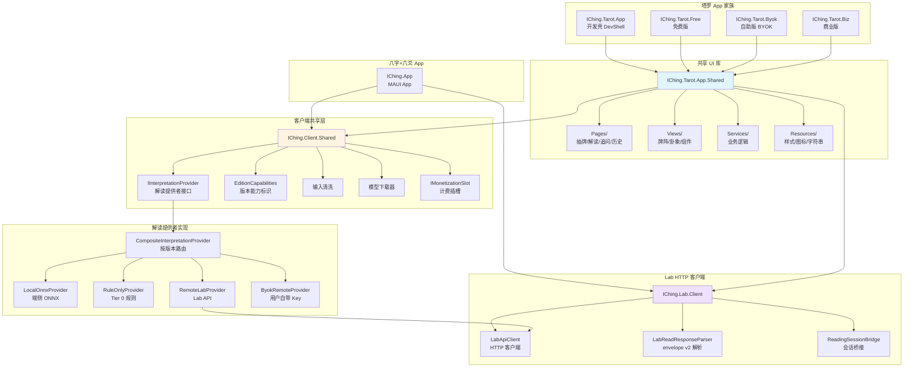

# 架构图集

> 编写日期：2026-07-22  
> 本文档使用 Mermaid 绘制 IChing 项目的核心架构，所有图表均基于代码库实际结构。

---

## 1. 总体分层架构图

展示 25 个项目在 4 层中的分布。Web/API 层提供 HTTP 接口，核心服务层负责编排与装配，领域引擎层实现排盘算法，客户端层承载 MAUI 应用。



---

## 2. AI 推理降级链流程图

`ChartInterpretationOrchestrator` 按配置的降级链依次尝试推理引擎。当前代码库仅实现了 ONNX 和模板兜底两个引擎，降级链通过 `plugins:fallbackChain` 配置。每个引擎失败时记录原因并继续下一个，全部失败时由 `TemplateFallbackEngine` 兜底，保证永不抛异常。



**引擎失败条件：**

| 引擎 | EngineId | 失败条件 | 备注 |
|------|----------|----------|------|
| OnnxGenAiEngine | `onnx-genai-qwen2.5-1.5b` | 模型目录不存在、`genai_config.json` 缺失、推理异常、取消 | 懒加载，首次调用时加载模型 |
| TemplateFallbackEngine | `template-fallback` | 永不失败 | `IsReady` 始终为 `true`，返回固定模板文本 |

**降级链配置示例（appsettings.json）：**

```json
{
  "plugins": {
    "fallbackChain": [
      "onnx-genai-qwen2.5-1.5b",
      "template-fallback"
    ]
  }
}
```

---

## 3. 排盘引擎降级链

每个域（bazi/liuyao/tarot/calendar）注册 6 个引擎：1 个内置 + 5 个插件模块提供。`ChartEngineRouter` 按配置的引擎链依次调用，返回错误结果时自动尝试下一个。



**引擎注册模式：**

```csharp
// BaziEnginesModule.Register()
public void Register(IServiceCollection services)
{
    services.AddSingleton<IChartEngine, BaziCnlunarPortEngine>();
    services.AddSingleton<IChartEngine, BaziOpenfateBridgeEngine>();
    services.AddSingleton<IChartEngine, BaziAlvamindBridgeEngine>();
    services.AddSingleton<IChartEngine, BaziLunarPythonBridgeEngine>();
    services.AddSingleton<IChartEngine, BaziMymcpBridgeEngine>();
}
```

**IChartEngine 接口：**

```csharp
public interface IChartEngine
{
    string Domain { get; }              // 领域标识：bazi/liuyao/tarot/calendar
    string EngineId { get; }            // 引擎唯一标识
    EngineMetadata Metadata { get; }    // 算法来源、版本、依据
    object Calculate(ChartRequest request);  // 执行排盘
}
```

**路由配置（appsettings.json）：**

```json
{
  "plugins": {
    "chartEngines": [
      {
        "domain": "bazi",
        "default": "cnlunar-port",
        "fallback": ["openfate-bridge", "alvamind-bridge"]
      }
    ]
  }
}
```

---

## 4. 3-Tier 解读模型流程图

三域（八字/六爻/塔罗）共用同一套 Tier 语义。Tier 0 仅规则引擎，Tier 1 单次 AI 生成，Tier 2 多段生成（塔罗走英译中两 pass）。

```mermaid
graph TD
    subgraph "Tier 0: 规则摘要"
        T0_Start[请求 tier=0] --> RuleEngine[RuleEngine<br/>Layer1 规则]
        RuleEngine --> RuleDigest[ruleDigest<br/>用神/旬空/旺衰]
        RuleDigest --> T0_Preview[Tier0Preview<br/>oneLiner + disclaimer]
        T0_Preview --> T0_End[返回 envelope v2<br/>无 AI 调用]
    end
    
    subgraph "Tier 1: 单次 AI 解读"
        T1_Start[请求 tier=1] --> Chart[排盘结果]
        Chart --> Input[ExchangeInput<br/>computedFacts + ruleDigest]
        Input --> Orchestrator[InferenceOrchestrator]
        Orchestrator --> PromptBuilder[PromptBuilder<br/>bazi-tier1-default]
        PromptBuilder --> AI[AI 引擎<br/>ONNX/Remote]
        AI --> Exchange[ReadingExchange<br/>mode=initial]
        Exchange --> Envelope[reading-envelope.v2]
    end
    
    subgraph "Tier 2: 双通道 AI 解读"
        T2_Start[请求 tier=2] --> T2_Chart[排盘结果]
        T2_Chart --> T2_Input[ExchangeInput]
        T2_Input --> T2_Orchestrator[InferenceOrchestrator]
        T2_Orchestrator --> T2_Pass1[Pass 1: 英文推理<br/>tarot-tier1-en]
        T2_Pass1 --> T2_TextEn[textEn]
        T2_TextEn --> T2_Pass2[Pass 2: 翻译成中文<br/>tarot-translate-to-zh]
        T2_Pass2 --> T2_Merge[合并输出<br/>textZh + textEn]
        T2_Merge --> T2_Envelope[reading-envelope.v2]
    end
    
    style T0_End fill:#d4edda
    style Envelope fill:#d4edda
    style T2_Envelope fill:#d4edda
```



**Tier 对照表：**

| Tier | 名称 | 费用 | AI 调用 | 典型篇幅 | 内容构成 |
|------|------|------|---------|----------|----------|
| 0 | 概览 Overview | 免费 | 否 | 50-150 字 | 结构化字段 + 规则模板 one-liner |
| 1 | 简析 Brief | 会员/次数 | 单次 | 200-400 字 | Layer1 结论 + 单次生成 |
| 2 | 详析 Deep | 高阶付费 | 多段 | 800-1500 字 | Layer1 全量 + 多段拼接（塔罗英译中） |

---

## 5. Lab Chat 会话流程图

`POST /lab/chat` 实现 ReadingExchange 协议，支持四种模式：register（创建会话）、initial（首次解读）、followup（追问）、append（追加对话）。会话存储在内存 `ConcurrentDictionary`，最多 100 个，FIFO 淘汰。



**LabChatRequest 结构：**

```csharp
public sealed record LabChatRequest(
    string Mode,                    // "register" | "initial" | "followup" | "append"
    string? Domain,                 // "bazi" | "liuyao" | "tarot"
    int Tier,                       // 0 | 1 | 2
    string? SessionId,              // 会话 ID
    string? UserQuestion,           // 追问内容
    string? AssistantReply,         // 追加的助手回复
    int? MaxTokens,                 // 最大 token 数
    ExchangeInput? Input,           // 事实输入
    string? InitialOutput,          // 初始输出文本
    object? Chart,                  // 排盘数据
    BaziReadRequest? Bazi,          // 八字请求
    LiuyaoReadRequest? Liuyao,      // 六爻请求
    TarotReadRequest? Tarot         // 塔罗请求
);
```

---

## 6. Accounts API + Lab Credits 鉴权流程图

Lab.Api 在 Tier ≥ `Accounts:RequireForTierGte`（默认 1）时，解读前调用 Accounts.Api 扣减额度。客户端通过 `Authorization: Bearer` 头传递 JWT，Lab.Api 转发给 Accounts.Api 验证。同一 `readingId` 24 小时内不重复扣费。



**配置（appsettings.json）：**

```json
{
  "Accounts": {
    "Enabled": true,
    "BaseUrl": "http://localhost:5002",
    "RequireForTierGte": 1
  }
}
```

**AccountsCreditsGateway 逻辑：**

```csharp
public async Task<AccountsConsumeResult> TryConsumeAsync(
    string? authorizationHeader, int tier, string? readingId, CancellationToken ct)
{
    if (!IsEnabled || tier < MinTier) 
        return AccountsConsumeResult.Skipped;
    
    if (string.IsNullOrWhiteSpace(authorizationHeader))
        return AccountsConsumeResult.Unauthorized("missing token");
    
    // POST to Accounts.Api /api/credits/consume
    // Forward Authorization header
    // Return Allowed / Unauthorized / InsufficientCredits
}
```

---

## 7. MAUI App 架构图

八字和六爻合并在 `IChing.App`，塔罗采用「共享 UI 库 + 版本 head」模式。四个塔罗 head（DevShell/Free/Byok/Biz）共享 `IChing.Tarot.App.Shared` 的页面、视图、服务和资源。三版本差异收敛到 `IInterpretationProvider` 和 `EditionCapabilities`。



**三版本差异：**

| 版本 | Head 项目 | AI 能力 | 解读路径 | 计费 |
|------|-----------|---------|----------|------|
| 免费版 | `IChing.Tarot.Free` | 仅 Tier 0 | RuleOnlyProvider | 无 |
| 自助版 | `IChing.Tarot.Byok` | Tier 0/1/2 | ByokRemoteProvider（用户 Key） | 无（用户自负） |
| 商业版 | `IChing.Tarot.Biz` | Tier 0/1/2 | RemoteLabProvider（Lab API） | Accounts 扣费 |

**IInterpretationProvider 接口：**

```csharp
public interface IInterpretationProvider
{
    Task<InterpretationResult> InterpretAsync(
        string domain, 
        object chart, 
        InterpretationOptions options, 
        CancellationToken ct);
}
```

**EditionCapabilities 标识：**

```csharp
public sealed record EditionCapabilities(
    bool SupportsAi,              // 是否支持 AI 解读
    bool SupportsByok,            // 是否支持用户自带 Key
    bool SupportsLabApi,          // 是否走 Lab API
    bool RequiresCredits,         // 是否需要额度
    int MaxFollowUpRounds       // 最大追问轮数
);
```

---

## 相关文档

- [架构说明](architecture.md)：项目分层、目录边界
- [Lab API](lab-api.md)：HTTP 路由、envelope v2
- [ReadingExchange 设计](design/reading-exchange.md)：统一 AI 交互协议
- [推理层设计](inference-layer-design.md)：Tier、模型、降级策略
- [API 参考](api-reference.md)：完整端点文档
