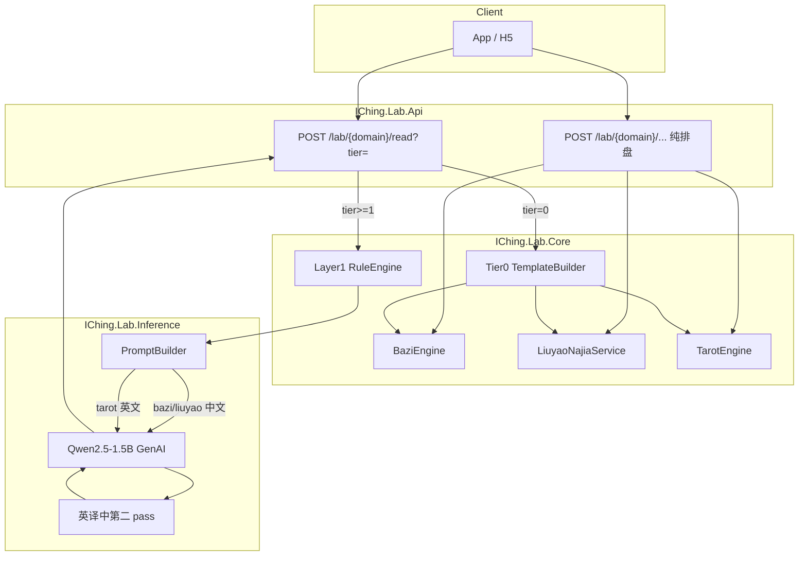
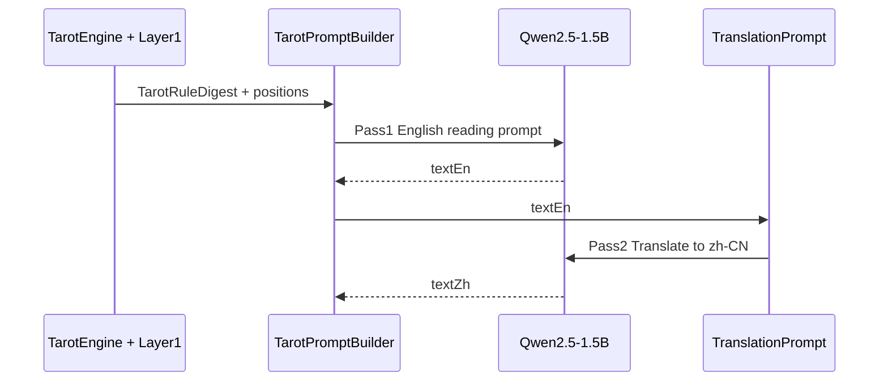

# 推理层产品设计：排盘 × ONNX × 分层解读

> **状态**：设计定稿 + 部署/提示词测试阶段  
> **日期**：2026-07-03  
> **适用范围**：八字、六爻、塔罗三域的本地 ONNX 解读层  
> **原则**：**计算 deterministic，解读 generative**

---

## 1. 目标与边界

### 1.1 做什么

| 层 | 技术 | 职责 |
|----|------|------|
| **排盘层** | `IChing.Lab.Core` 确定性算法 | 四柱、纳甲、六亲、抽牌、牌阵 |
| **规则层 Layer1** | 查表 + 轻量规则引擎 | 用神、旬空、旺衰、牌阵统计——**结论给模型，不让模型推** |
| **叙述层 Layer2** | Qwen2.5-1.5B ONNX GenAI | 把结构化结论写成可读中文（塔罗经英译中） |

### 1.2 不做什么

- 不让 LLM 计算干支、节气、动爻概率、纳甲装卦
- Tier 0（免费概览）**零 ONNX 调用**
- 不在 Tier 0 依赖会员或模型文件

### 1.3 已确认产品决策

| # | 决策 | 说明 |
|---|------|------|
| 1 | **三档 tier** | Tier 0 免费概览；Tier 1/2 付费 ONNX 解读 |
| 2 | **额度策略** | Tier 1+ 默认会员/次数制；**后续通过推广活动刷新额度**（邀请、签到、活动码等） |
| 3 | **六爻未分类问事** | 默认以**世爻**为用神 |
| 4 | **塔罗语言管线** | **英文完整生成 → 再翻译成简体中文**（小阿卡纳牌义以英文 Waite 为准） |
| 5 | **模型选型** | **Qwen2.5-1.5B-Instruct**，ONNX Runtime GenAI 格式，INT4/量化优先 |

---

## 2. 三档内容分层（Tier）

三域（八字 / 六爻 / 塔罗）共用同一套 `tier` 语义，前端与计费只认 tier，不认术种。

### 2.1 Tier 对照表

| Tier | 名称 | 费用 | ONNX | 典型篇幅 | 内容构成 |
|------|------|------|------|----------|----------|
| **0** | 概览 Overview | **免费** | 否 | 50～150 字 | 结构化字段 + 规则模板 one-liner |
| **1** | 简析 Brief | 会员/次数 | 是 | 200～400 字 | Layer1 结论 + 单次生成 |
| **2** | 详析 Deep | 高阶付费 | 是 | 800～1500 字 | Layer1 全量 + 多段生成拼接 |

### 2.2 Tier 0 — 免费概览（明确规格）

**硬性要求**：不加载模型、不进入 `IChing.Lab.Inference`、可无限刷（仅 CPU）。

#### 六爻 Tier 0

```json
{
  "tier": 0,
  "domain": "liuyao",
  "summary": {
    "originalHexagram": "水雷屯",
    "changedHexagram": "泽雷随",
    "changingLineIndexes": [2, 5],
    "shiYaoIndex": 3,
    "yingYaoIndex": 6,
    "oneLiner": "屯卦初难，二、五爻动而趋随，事有转机但需顺势。"
  },
  "chart": { },
  "disclaimer": "概览由规则模板生成，非 AI 解读"
}
```

- `chart`：现有 `LiuyaoNajiaResult` 全量
- `oneLiner`：由 Layer1 摘要 2～3 条规则结论模板拼接（**非 LLM**）

#### 八字 Tier 0

- 四柱、纳音、大运列表（已有 `BaziEngine`）
- 模板一句：日主 + 月令 + 关键词表（如「木旺需金制」级别，不做深度喜用神）

#### 塔罗 Tier 0

- 现有抽牌结果 + **补全 `positionContext`**
- 格式：`[过去] The Tower (逆位): 突变、恐惧变化`（中文关键词来自 Layer1 模板；牌义英文源数据可保留在 `meaningEn` 字段供调试）

### 2.3 Tier 1 — 简析

- 单次 ONNX 生成
- Prompt 注入 Layer1 **结论句**（非 raw 卦象 JSON 裸奔）
- `max_tokens`：512（六爻/八字）；塔罗 600（3 牌阵）或 800（10 牌阵慎用单次）

### 2.4 Tier 2 — 详析

- **多段生成**（推荐）：用神 / 动变 / 应期 / 建议 各 ~200 字，拼接成文
- 六爻 Celtic 级复杂度不适用；塔罗 **Celtic Cross 必须分段**（见 §7）
- `max_tokens`：每段 400～512，共 3～4 段

### 2.5 额度与推广（后续）

```
用户额度 = 基础会员额度 + 活动赠送额度
活动类型（待定）：邀请注册、分享解读、签到、运营活动码
```

- Tier 0：不参与额度计数
- Tier 1+：扣减 `interpret_credits`；缓存同一 `readingId` 24h 内重复请求不扣费
- 推广刷新额度：**独立表或 Redis 计数**，与会员周期解耦

---

## 3. 架构



### 3.1 模块职责

| 项目 | 路径 | 职责 |
|------|------|------|
| Core | `src/IChing.Lab.Core/` | 排盘 + Layer1 + Tier0 模板 |
| Inference | `src/IChing.Lab.Inference/` | Prompt 组装 + ONNX 推理 |
| PromptTest | `src/IChing.Lab.PromptTest/` | 本地提示词/模型试跑（无 HTTP） |
| Api | `src/IChing.Lab.Api/` | HTTP 探针，后续接 `/read` |

---

## 4. Layer1 规则引擎

**原则**：模型 **narrate，不 infer**。Layer1 输出 `RuleDigest`，作为 Tier 1+ 的硬输入。

### 4.1 六爻规则模块（P0）

| 模块 | 输入 | 输出示例 | 实现 |
|------|------|----------|------|
| 世应 | `Line.Role` | `世爻=3爻兄弟子水` | IChingLibrary 已有 |
| 动变 | `IsChanging` + 变卦 | `二爻动化回头克` | 本/变卦六亲五行对比 |
| 月建 / 日辰 | `CastingTime` | `月建寅，日辰甲子` | lunar-csharp |
| 旬空 | 日干支 | `旬空：戌亥` | 六十甲子旬空查表 |
| 旺相休囚 | 月建 vs 爻五行 | `用神临月建旺` | 五行生克表 |
| 用神 | `question` 分类 | `问财，用神妻财酉金4爻` | 关键词 → 用神映射 |

#### 用神映射表（默认）

| 问事类型 | 关键词示例 | 用神 |
|----------|------------|------|
| 财 | 投资、赚钱、生意 | 妻财 |
| 官 | 工作、升职、考试 | 官鬼 |
| 情 | 感情、婚姻、桃花 | 妻财 / 官鬼（二期分性别） |
| 健康 | 疾病、身体 | 子孙（医药）或官鬼（病位）——**产品定一派** |
| 讼 | 官司、纠纷 | 官鬼 + 世应 |
| **未分类** | — | **世爻**（已确认） |

问事分类：**关键词匹配**（免费、确定性），不上 NLP 模型。

#### Layer1 输出结构

```csharp
public record LiuyaoRuleDigest(
    string ShiYaoSummary,
    string YingYaoSummary,
    IReadOnlyList<string> ChangingSummaries,
    string MonthBranch,
    string DayBranch,
    string KongWang,
    string YongShenSummary,
    string WangShuaiSummary,
    IReadOnlyList<string> Alerts   // "用神旬空", "动化回头克"
);
```

### 4.2 八字 Layer1（P1）

- 十神、刑冲合害、日主强弱（简版）
- 复用 lunar-csharp，与六爻共享日历

### 4.3 塔罗 Layer1（P0，配合英译中）

| 统计项 | 用途 |
|--------|------|
| 大/小阿卡纳比例 | 议题轻重 |
| 四元素分布 W/C/S/P | 行动/情感/思维/物质倾向 |
| 逆位比例 | 阻滞感修饰 |
| 牌阵类型 | 时间线 vs 十字结构叙述框架 |

输出 `TarotRuleDigest` 进英文 Prompt（模型英文更稳）。

---

## 5. API 设计

### 5.1 推荐形态：混合 B'

保留纯排盘 API（调试、只看卦象）+ 统一 read 入口（带 tier）。

| 方法 | 路径 | tier | 说明 |
|------|------|------|------|
| POST | `/lab/bazi` | — | 纯排盘 |
| POST | `/lab/liuyao/coin` | — | 纯起卦 |
| POST | `/lab/liuyao/time` | — | 纯时间卦 |
| POST | `/lab/tarot/draw` | — | 纯抽牌 |
| POST | `/lab/bazi/read?tier=0\|1\|2` | 0～2 | 排盘 + 可选解读 |
| POST | `/lab/liuyao/read?tier=0\|1\|2` | 0～2 | 起卦 + 可选解读 |
| POST | `/lab/tarot/read?tier=0\|1\|2` | 0～2 | 抽牌 + 可选解读 |
| POST | `/lab/interpret` | 1～2 | 已有卦象/命盘 JSON → 解读（高级） |
| GET | `/lab/interpret/status` | — | 模型加载状态 |

### 5.2 统一响应 Envelope

```json
{
  "domain": "liuyao",
  "tier": 1,
  "engine": {
    "paipan": "IChingLibrary.SixLines",
    "rules": "iching-rules-v1",
    "narrative": "qwen2.5-1.5b-onnx-genai"
  },
  "chart": { },
  "ruleDigest": { },
  "tier0Preview": {
    "oneLiner": "..."
  },
  "narrative": {
    "text": "简体中文解读正文",
    "textEn": "仅塔罗 tier>=1 时保留英文初稿",
    "isFallback": false,
    "sections": [
      { "key": "yongShen", "title": "用神", "text": "..." }
    ]
  }
}
```

- 付费档仍返回 `tier0Preview`，便于 UI「免费预览 + 解锁详析」
- 塔罗 `textEn` 保留供 QA 对照翻译质量

### 5.3 请求示例

**六爻 Tier 1**

```http
POST /lab/liuyao/read?tier=1
Content-Type: application/json

{
  "method": "coin",
  "seed": 42,
  "question": "这次投资能否成？",
  "focus": "财运"
}
```

**塔罗 Tier 1（英译中）**

```http
POST /lab/tarot/read?tier=1
Content-Type: application/json

{
  "spreadId": "past-present-future",
  "question": "Should I change jobs this year?",
  "seed": 7
}
```

---

## 6. 模型部署（Qwen2.5-1.5B）

### 6.1 运行时

- NuGet：`Microsoft.ML.OnnxRuntimeGenAI`（与现有 `ChartInterpretationService` 一致）
- 模型格式：**必须含 `genai_config.json`**（ORT GenAI 专用，非普通 ONNX 图）

### 6.2 推荐模型源

| 优先级 | HuggingFace | 说明 |
|--------|-------------|------|
| **P0 调研** | [tonythethompson/Qwen2.5-1.5B-Instruct-ONNX](https://huggingface.co/tonythethompson/Qwen2.5-1.5B-Instruct-ONNX) | 顶层 FP32 GenAI 包，含 `chat_template.jinja` |
| P1 体积 | 同仓库 `onnx/model_q4.onnx` 等 | 需实测是否与 GenAI API 兼容 |
| 备选 | [khanuckaeff/Qwen2.5-1.5B-Instruct-Olive-Onnx](https://huggingface.co/khanuckaeff/Qwen2.5-1.5B-Instruct-Olive-Onnx) | Olive 量化；**未必** GenAI 格式，加载失败则弃用 |
| 回退 | [xiaoyao9184/Qwen3-0.6B-onnx-genai](https://huggingface.co/xiaoyao9184/Qwen3-0.6B-onnx-genai) | 现有 0.6B，仅作管线验证 |

### 6.3 下载与目录

```bash
# 仓库根目录
bash scripts/download-qwen-15b-model.sh ./models/qwen2.5-1.5b-genai
```

目录结构（加载前检查）：

```
models/qwen2.5-1.5b-genai/
├── genai_config.json      # 必须存在
├── model.onnx
├── model.onnx.data        # 或 external data
├── tokenizer.json
├── tokenizer_config.json
└── chat_template.jinja    # Qwen2.5 建议保留
```

配置（`appsettings.json`）：

```json
{
  "Inference": {
    "ModelPath": "./models/qwen2.5-1.5b-genai",
    "MaxConcurrent": 1,
    "DefaultMaxTokens": 512
  }
}
```

### 6.4 硬件预期（CPU INT4 / 量化）

| 指标 | 参考值 |
|------|--------|
| 内存 | 1.5～3 GB（视量化） |
| Tier 1 延迟 | 8～20 s / 512 tokens |
| Tier 2（4 段） | 40～80 s |
| 并发 | **单例模型 + 队列**（`MaxConcurrent=1`） |

### 6.5 部署检查清单

- [ ] `genai_config.json` 存在且 ORT GenAI 版本匹配
- [ ] `GET /lab/interpret/status` → `{ "loaded": true }`
- [ ] PromptTest 跑通 3 个 fixture（见 §9）
- [ ] 塔罗英译中第二 pass 无增删事实（人工 spot check）
- [ ] 模型目录在 `.gitignore`，CI 不打包

### 6.6 降级策略

| 条件 | 行为 |
|------|------|
| 模型目录缺失 | Tier 0 正常；Tier 1+ 返回 Layer1 结论 + 模板扩写，`isFallback: true` |
| 推理异常 | 同上，记录日志 |
| 翻译 pass 失败 | 返回英文初稿 + 提示「翻译暂不可用」 |

---

## 7. 塔罗 ONNX 适配（英文 → 中文）

### 7.1 为何英译中

- 小阿卡纳将导入 **英文 Waite 完整牌义**（见 `docs/archive/research/research-tarot-optimization.md`）
- 1.5B 模型**英文叙述质量高于中文术语文本**
- 两 pass 可分离「事实层（英文）」与「呈现层（中文）」，便于 QA

### 7.2 管线



### 7.3 Pass 1 — 英文解读 Prompt 模板

```text
<|im_start|>system
You are a tarot reading assistant. The spread below was drawn by the system.
Do NOT change card names, positions, or upright/reversed states.
Do NOT invent cards that are not listed.
Write in clear English only.

<|im_start|>user
Question: {question}
Spread: {spreadTitle}
Rule summary:
- Major arcana: {majorCount}/{total}
- Elements: Wands {w} Cups {c} Swords {s} Pentacles {p}
- Reversed: {revCount}/{total}

Positions:
1. [{positionTitle} / {positionContext}] {cardName} ({upright|reversed}) — {meaningEn}
2. ...

Write a {wordLimit}-word reading that follows the spread's narrative arc.
For Past-Present-Future emphasize timeline; for Celtic Cross emphasize cross tension vs time column.

<|im_start|>assistant
```

### 7.4 Pass 2 — 翻译 Prompt 模板

```text
<|im_start|>system
Translate the following English tarot reading into natural Simplified Chinese.
Keep card names in standard Chinese tarot translations where common (e.g. The Tower → 塔).
Do NOT add, remove, or change the divination conclusions.

<|im_start|>user
English:
{textEn}

<|im_start|>assistant
```

### 7.5 牌阵与 token 策略

| 牌阵 | 牌数 | Tier 1 | Tier 2 |
|------|------|--------|--------|
| past-present-future | 3 | Pass1 400 tok + Pass2 400 tok | 可选加「建议」段 |
| situation-action-outcome | 3 | 同上 | 同上 |
| celtic-cross | 10 | Pass1 600 tok（易漏牌，需 QA） | **3 段 Pass1**（十字 / 时间柱 / 总结）再统一 Pass2 |

### 7.6 Tier 0 塔罗（免费）

- **不调用 ONNX**
- 输出：`positionTitle + cardName + (逆位) + meaningZhSnippet`
- `meaningZhSnippet`：大阿卡纳用现有中文；小阿卡纳 Phase A 可用英文 meaning 的前 20 词 + 「（英文牌义）」标注，或静态中译表

---

## 8. 六爻 / 八字 Prompt 模板（中文直接生成）

### 8.1 六爻 Tier 1

```text
<|im_start|>system
你是六爻解读助手。卦象与规则结论由系统计算，请勿修改卦名、爻位、六亲、干支数据。
不要编造未提供的神煞或应期日期。

<|im_start|>user
问事：{question}
关注：{focus ?? "综合"}

【规则摘要】
{ruleDigest 逐行}

【卦象数据】
{chart JSON 精简版}

请用简体中文写一段 200～400 字简析，先点用神与世应，再论动变。

<|im_start|>assistant
```

### 8.2 六爻 Tier 2（分段 keys）

| section key | 标题 | 内容要点 |
|-------------|------|----------|
| `yongShen` | 用神 | 用神旺衰、空破 |
| `dongBian` | 动变 | 动爻、变卦、回头生克 |
| `yingQi` | 应期 | 仅基于 rule 给出的月日空破，不瞎编日期 |
| `advice` | 建议 | 趋势 + 行动建议 |

每段独立调用 ONNX，拼接为 `narrative.sections`。

### 8.3 八字 Tier 1

```text
<|im_start|>system
你是八字解读助手。四柱与大运由系统计算，请勿修改干支。

<|im_start|>user
关注：{focus}
命盘：{baziChart JSON}
规则摘要：{baziRuleDigest}

请用简体中文写 200～400 字简析。

<|im_start|>assistant
```

---

## 9. 提示词与模型测试（当前阶段）

**目标**：在接 API `/read` 之前，本地验证模型加载、延迟、幻觉率、英译中质量。

### 9.1 工具

```bash
# 1. 下载模型
bash scripts/download-qwen-15b-model.sh

# 2. 试跑内置 fixture（六爻 / 八字 / 塔罗英译中）
cd src
dotnet run --project IChing.Lab.PromptTest -- --model ../models/qwen2.5-1.5b-genai

# 3. 指定单个 fixture
dotnet run --project IChing.Lab.PromptTest -- \
  --model ../models/qwen2.5-1.5b-genai \
  --fixture liuyao-tier1

# 4. 只打印 Prompt 不推理（无模型时）
dotnet run --project IChing.Lab.PromptTest -- --dry-run --fixture tarot-tier1-en
```

Fixture 文件：`docs/prompts/fixtures/*.json`

### 9.2 测试矩阵

| ID | Fixture | 验证点 |
|----|---------|--------|
| T1 | `liuyao-tier1` | 中文不乱改卦名、提到用神 |
| T2 | `liuyao-tier2-yongShen` | 单段 200 字内 |
| T3 | `bazi-tier1` | 不改四柱 |
| T4 | `tarot-tier1-en` | 英文不编造牌 |
| T5 | `tarot-tier1-en-zh` | 翻译不增删结论 |
| T6 | `tarot-celtic-tier2-en` | 10 牌分段不遗漏 |

### 9.3 通过标准（人工 QA）

- [ ] **事实守恒**：卦名/牌名/正逆位与输入一致
- [ ] **无干支心算**：八字解读不修改 `yearPillar` 等字段含义
- [ ] **用神**：六爻 Tier1 必须提到 ruleDigest 中的用神
- [ ] **翻译忠实**：塔罗中文不新增牌或改变倾向
- [ ] **延迟可接受**：Tier1 单次 < 25s（开发机 CPU）
- [ ] **降级**：删模型目录后 PromptTest dry-run 仍输出完整 Prompt

### 9.4 记录模板

每次试跑记录：

```
日期：
模型路径：
Fixture：
耗时(ms)：
Pass1 字数 / Pass2 字数：
幻觉问题（有/无，描述）：
Prompt 修改建议：
```

结果建议存本地：`docs/prompts/runs/`（gitignore 可选）

---

## 10. 实施路线图

| 阶段 | 内容 | 产出 |
|------|------|------|
| **Phase 0（当前）** | 部署 1.5B + PromptTest + 文档 | 模型可加载、3 域 Prompt 试跑 |
| Phase 1 | Layer1 六爻 + Tier0 模板 + `positionContext` 塔罗 | Core 无 ONNX 的免费档 |
| Phase 2 | `/lab/{domain}/read` + 统一 envelope | API 可演示 |
| Phase 3 | 会员额度 + 推广刷新 | 计费联调 |
| Phase 4 | 小阿卡纳英文牌库 + 塔罗 Phase A 数据 | 英译中质量提升 |
| Phase 5 | 八字 Layer1 + Tier2 分段 | 三域详析齐全 |

---

## 11. 相关文档

| 文档 | 说明 |
|------|------|
| [onnx-models-survey.md](../archive/research/onnx-models-survey.md) | 模型选型调研归档 |
| [research-paipan-algorithms.md](../archive/research/research-paipan-algorithms.md) | 排盘算法调研归档 |
| [research-tarot-optimization.md](../archive/research/research-tarot-optimization.md) | 塔罗 Layer1 数据调研归档 |
| [tech-stack-dotnet.md](./tech-stack-dotnet.md) | .NET Lab 栈 |
| [prompts/fixtures/](./prompts/fixtures/) | 提示词测试样例 |

---

## 12. 附录：Chat 模板说明

Qwen2.5-Instruct 使用 ChatML 风格：

```text
<|im_start|>system
...

<|im_start|>user
...

<|im_start|>assistant
```

若加载 1.5B 后输出乱码或复读，检查：

1. 模型目录是否含 `chat_template.jinja`
2. `Microsoft.ML.OnnxRuntimeGenAI` 版本与模型导出版本是否匹配
3. 尝试降低 `max_length`，增大 `temperature` 仅在翻译 pass 微调（默认 greedy 即可）

---

*文档版本：v1.0 · 与 Lab 代码同步维护*
