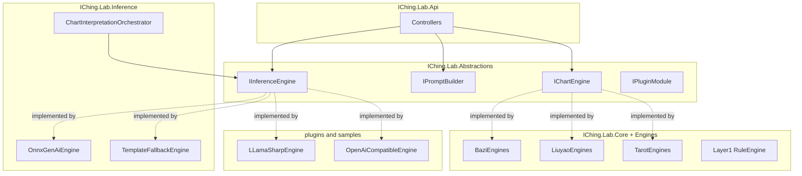

# 规则/插件设计（已实现）

> **状态**：已实现（Abstractions 接口 + PluginLoader + 四域 Engines + Composition 装配 + 三模式推理引擎）<br>
> **日期**：2026-07-09（实现同步） / 2026-07-15（文档拆分）<br>
> **原则**：保持 [inference-layer-design.md](./inference-layer-design.md) 的「计算 deterministic，解读 generative」边界<br>
> **调研归档**：[plugin-ecosystem-survey.md](../archive/research/plugin-ecosystem-survey.md)<br>
> **相关 Specs**：[archive/specs](../archive/specs/README.md)

---

## 1. 目标（已验收）

| # | 目标 | 现状 |
|---|------|------|
| G1 | 排盘算法可替换 | `IChartEngine` + `src/*Engines` / `samples` 插件 |
| G2 | Prompt 模板可热配 | Scriban `prompts/*.txt` + `IReadingTemplateRegistry` |
| G3 | 解读引擎可切换 | `IInferenceEngine` + `plugins:fallbackChain` |
| G4 | 三层互不耦合 | Abstractions 独立；排盘不知 Inference |
| G5 | 配置驱动注册 | `appsettings.json` → `plugins:` + DI |
| G6 | 降级链一致 | A → B → C → template，`isFallback: true` |

---

## 2. 总体架构



装配入口：`IChing.Lab.Composition`。外部 DLL 由 `IChing.Lab.PluginLoader` 经 `AssemblyLoadContext` 加载。

---

## 3. 三对象接口

### 3.1 排盘 `IChartEngine`

定义：[`src/IChing.Lab.Abstractions/Engines/IChartEngine.cs`](../../src/IChing.Lab.Abstractions/Engines/IChartEngine.cs)

- `Domain`：`bazi` / `liuyao` / `tarot` / `calendar`
- `EngineId`：写入响应 `engine.paipan`，便于审计
- 官方实现：`src/BaziEngines`、`src/LiuyaoEngines`、`src/TarotEngines`、`src/CalendarEngines`

### 3.2 Prompt `IPromptBuilder`

定义：[`src/IChing.Lab.Abstractions/Prompts/IPromptBuilder.cs`](../../src/IChing.Lab.Abstractions/Prompts/IPromptBuilder.cs)

- 模板文件：`prompts/{domain}-tier{N}-*.txt`（Scriban）
- 注册表：Core 侧 `IReadingTemplateRegistry`（见 [reading-template-inventory.md](./design/reading-template-inventory.md)）
- Tier 0 仍走规则模板，不进 Scriban 热加载

### 3.3 解读 `IInferenceEngine`

定义：[`src/IChing.Lab.Abstractions/Engines/IInferenceEngine.cs`](../../src/IChing.Lab.Abstractions/Engines/IInferenceEngine.cs)

| 模式 | EngineId 示例 | 实现位置 |
|------|---------------|----------|
| A 进程内 | `onnx-genai-qwen2.5-1.5b` | `src/IChing.Lab.Inference/Engines/OnnxGenAiEngine.cs` |
| A 进程内 | `llama-sharp-qwen3-4b` | `samples/LLamaSharpEngine/` |
| B 本地 HTTP | `ollama-local` / `llama-server-local` | `samples/OpenAiCompatibleEngine/` |
| C 远程 API | `openai-remote` / `azure-openai-remote` / DeepSeek | `samples/OpenAiCompatibleEngine/` |
| 降级 | `template-fallback` | Inference 内置 |

编排与降级：`ChartInterpretationOrchestrator` 按 `plugins:fallbackChain` 顺序尝试；全部失败则模板扩写并标记 `isFallback: true`。

模式 B/C 共享基类：[`samples/OpenAiCompatibleEngine/OpenAiCompatibleEngineBase.cs`](../../samples/OpenAiCompatibleEngine/OpenAiCompatibleEngineBase.cs)<br>
（旧 `IChing.Desktop/OpenAiChatClient` 已暂停，勿再引用。）

插件模块入口：[`IPluginModule`](../../src/IChing.Lab.Abstractions/Plugins/IPluginModule.cs)。

---

## 4. 加载机制

- `PluginLoadContext`：`AssemblyLoadContext(isCollectible: true)` + `AssemblyDependencyResolver`
- 共享契约 `IChing.Lab.Abstractions` 落在 default context，保证接口类型同一
- 配置段 `plugins.externalAssemblies` 声明 DLL 路径；构建脚本见 `scripts/build-inference-plugins.ps1`、`scripts/build-chart-plugins.ps1`
- 健康检查：`GET /health/engines`、`GET /health/chart-engines`

---

## 5. 配置 Schema（摘录）

```json
{
  "plugins": {
    "chartEngines": [
      { "id": "lunar-csharp", "domain": "bazi", "default": true },
      { "id": "iching-sixlines", "domain": "liuyao", "default": true },
      { "id": "iching-tarot", "domain": "tarot", "default": true }
    ],
    "inferenceEngines": [
      { "id": "onnx-genai-qwen2.5-1.5b", "mode": "in-process", "default": true, "modelPath": "./models/qwen2.5-1.5b-genai" },
      { "id": "ollama-local", "mode": "local-http", "baseUrl": "http://localhost:11434/v1", "model": "qwen2.5:7b" },
      { "id": "openai-remote", "mode": "remote-api", "baseUrl": "https://api.openai.com/v1", "model": "gpt-4o-mini", "apiKeyKey": "OpenAI:ApiKey" }
    ],
    "fallbackChain": ["onnx-genai-qwen2.5-1.5b", "ollama-local", "openai-remote", "template-fallback"],
    "externalAssemblies": [
      { "name": "LLamaSharpEngine", "path": "plugins/LLamaSharpEngine.dll" },
      { "name": "OpenAiCompatibleEngine", "path": "plugins/OpenAiCompatibleEngine.dll" }
    ]
  }
}
```

API key 走 User Secrets / 环境变量，不入仓。

---

## 6. 规则插件（Layer1）

- 实现：`src/IChing.Lab.Core/Rules`
- 运行时启停与权重：`PUT /lab/rules/plugins/{id}` → `App_Data/rule-engine-options.json`
- 流派 Prompt 扩展：见 [reading-plugin-extensions.md](./design/reading-plugin-extensions.md)

---

## 7. 相关文档

- [architecture.md](./architecture.md)
- [inference-layer-design.md](./inference-layer-design.md)
- [reading-exchange.md](./design/reading-exchange.md)
- [plugin-ecosystem-survey.md](../archive/research/plugin-ecosystem-survey.md)（调研归档）
- [archive/specs](../archive/specs/README.md)（已完成实现 specs）
