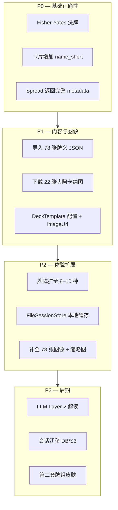

# 塔罗模块优化调研

> 本文档用于 **IChing Lab 塔罗模块** 的优化方向调研，不构成最终产品规格。  
> 调研日期：2026-07-03  
> 代码位置：`src/IChing.Lab.Core/Tarot/`

---

## 1. 现状摘要

### 1.1 已实现

| 组件 | 文件 | 能力 |
|------|------|------|
| 牌库 | `TarotDeck.cs` | 78 张（22 大阿卡纳独立释义 + 56 小阿卡纳模板拼接） |
| 抽牌 | `TarotEngine.cs` | 3 种牌阵、seed 可复现、正/逆位 50% |
| API | `LabController.cs` | `POST /lab/tarot/draw`、`GET /lab/tarot/spreads` |

### 1.2 与行业做法的差距

| 维度 | 当前实现 | 常见做法 | 差距 |
|------|----------|----------|------|
| 牌义 | 大阿卡纳独立；小阿卡纳「花色模板」 | 78 张逐张正/逆位 | 小阿卡纳质量差 |
| 牌面 | 无 | `name_short` + 图像 URL | 缺标识与资源 |
| 牌阵 | 3 种，硬编码 | 10–20+ 种，JSON 配置 | 偏少 |
| 抽牌 | `OrderBy(_ => rng.Next())` | Fisher-Yates 不放回 | 有偏差风险 |
| 解读 | 仅牌义，忽略位置语境 | 牌 × 位置 × 正逆 | 语义浅 |
| 会话 | 无 | 本地 JSON → DB | 待建 |

### 1.3 约束（产品决策）

1. **LLM 暂缓**，后续接入 Layer-2 叙事解读
2. **小阿卡纳**可以尝试逐张导入
3. **图像**：优先凑齐 22 张大阿卡纳，再扩全套 78 张
4. **会话**：当前用本地目录缓存，后期迁移 DB/S3
5. **牌阵**需更丰富；牌面图像通过配置模板统一切换

---

## 2. LLM 暂缓 — 现在该预留什么

LLM 不接，但 **Reading 结构应面向 Layer-2 设计**，避免以后大改。

建议在 `TarotPositionReading` 中预留（不必现在调用模型）：

```csharp
public record TarotPositionReading(
    string PositionKey,
    string PositionTitle,
    string PositionContext,   // 已有 Context，目前未写入 Reading
    string CardName,
    string NameShort,         // ar00 / wapa — 图像与外部数据源对齐
    bool Reversed,
    string Meaning,           // Layer-1 关键词
    string? ImageUrl          // 由 DeckTemplate 解析
);
```

**原则（RoxyAPI / TarotSchema 共识）：**

- **Layer-1**：确定性抽牌 + 结构化牌义 + 位置语境
- **Layer-2**（后续）：`question + positions[]` → LLM 合成叙事

`question` 已在 API 中传入但未参与算法，这是正确方向；会话缓存里一并存下来即可。

---

## 3. 小阿卡纳 — 数据源与导入方案

### 3.1 当前问题

小阿卡纳由模板拼接生成：

```csharp
// TarotDeck.cs — 56 张共用 4 套花色语义
$"{rank} · {suit.Upright}"   // 例: "Three · 思维与决断"
```

无法区分「Three of Swords（心碎）」与「Three of Cups（庆祝）」。

### 3.2 推荐数据源（MIT 许可，可商用）

| 来源 | 内容 | 许可 | 适配性 |
|------|------|------|--------|
| [tarotapi.dev](https://tarotapi.dev/api/v1/cards) | Waite 原文 `meaning_up/rev` + `name_short` | 开源 JSON 可直取 | 英文，权威，与图像命名一致 |
| [Deckaura 78 张数据集](https://huggingface.co/datasets/Blacik/deckaura-tarot-card-meanings) | 正/逆/爱情/事业/Yes-No + 元素星座 | MIT | 英文关键词，LLM 友好 |
| [gokimedia/tarot-card-meanings](https://github.com/gokimedia/tarot-card-meanings) | 同上，npm/pypi 包 | MIT | 便于脚本导入 |

tarotapi 卡片字段示例：

```json
{
  "type": "major",
  "name_short": "ar00",
  "name": "The Fool",
  "meaning_up": "Folly, mania, extravagance...",
  "meaning_rev": "Negligence, absence, distribution..."
}
```

### 3.3 建议方案

**Phase A — 最小改动：**

1. 新增 `data/tarot/cards.json`（78 条，含 `name_short`、正逆位）
2. 从 [tarotapi card_data.json](https://github.com/ekelen/tarot-api/blob/main/static/card_data.json) 或 Deckaura 导入
3. 中文含义两种策略二选一：
   - **A1**：英文关键词 + 后续 LLM 翻译（最快）
   - **A2**：大阿卡纳保留现有中文，小阿卡纳逐张补中文（工作量大）

**Phase B — 为 LLM 预埋：**

每条牌增加 `keywords[]`、`element`、`arcana`、`suit`，便于后续 prompt 组装。

---

## 4. 图像 — 22 张大阿卡纳 vs 全套 78 张

### 4.1 版权说明

RWS 1909 原图在多数法域已进入公版，但 **U.S. Games 仍持有 "Rider-Waite" 商标**，且对特定上色版主张权利。实践建议：

- 使用 Wikimedia / sacred-texts 扫描版
- 产品文案避免「官方 Rider-Waite™」
- **本地托管**，不依赖第三方 CDN uptime

参考：[Wild Hunt 版权讨论](https://wildhunt.org/2021/01/rider-waite-smith-tarot-deck-may-enter-public-domain.html)

### 4.2 图像来源对比

| 方案 | 规模 | 体积 | 维护 |
|------|------|------|------|
| [sacred-texts 扫描](http://www.sacred-texts.com/tarot/pkt/img/) | 78 张 | ~2–3 MB JPG | wget 脚本一次拉取 |
| [luciellaes CC0 包](https://luciellaes.itch.io/rider-waite-smith-tarot-cards-cc0) | 78 张 PNG/JPG | 3–20 MB | 手动下载，质量更好 |
| [taroticar/TarotCards](https://github.com/taroticar/TarotCards) | 多牌组 + 720px/缩略图 | 可裁剪 | 含下载/缩放脚本 |
| [sixseeds/tarot-api](https://github.com/sixseeds/tarot-api) | GitHub Pages 静态托管 | 0 本地存储 | 依赖外部，**不推荐生产** |

tarotapi.dev 历史上多次换域名（Heroku → Render → tarotapi.dev），**不建议运行时外链拉图**。

### 4.3 命名规范（与 tarotapi 对齐）

```
大阿卡纳: ar00.jpg … ar21.jpg   (ar00 = The Fool)
小阿卡纳: {suit}{rank}.jpg
  suit: wa / cu / sw / pe
  rank: ac, 02–10, pa, kn, qu, ki
  例: waac = Ace of Wands, cupa = Page of Cups
```

wget 脚本参考：[adidahiya gist](https://gist.github.com/adidahiya/957210094ded44ecf7c159a9de487275)

### 4.4 推荐路径

```
Phase 1（快速验证）:
  wwwroot/tarot/decks/rider-waite/major/ar00.jpg … ar21.jpg   (~500 KB)
  + scripts/download-tarot-images.sh

Phase 2（完整体验）:
  补全 minor/ 56 张 + back.jpg
  生成 thumbs/ 360px 供列表预览
```

---

## 5. 本地目录会话缓存 → 后期迁移

### 5.1 目录结构

```
data/tarot/
├── sessions/
│   └── {uuid}.json          # 单次 Reading 快照
├── decks/
│   └── rider-waite/         # 图像资源
└── config/
    ├── decks.json           # 牌组模板
    └── spreads.json         # 牌阵定义（从代码迁出）
```

### 5.2 会话 JSON 示例

```json
{
  "id": "a1b2c3d4-...",
  "createdAt": "2026-07-03T03:30:00Z",
  "deckId": "rider-waite",
  "spreadId": "celtic-cross",
  "question": "职业发展",
  "seed": 42,
  "positions": []
}
```

### 5.3 接口设计（便于迁移）

```csharp
public interface ITarotSessionStore
{
    Task<string> SaveAsync(TarotReading reading, CancellationToken ct = default);
    Task<TarotReading?> GetAsync(string id, CancellationToken ct = default);
    Task<IReadOnlyList<TarotSessionSummary>> ListAsync(int limit = 20, ...);
}

// Phase 1: FileTarotSessionStore → data/tarot/sessions/
// Phase 2: PostgresTarotSessionStore / Redis（同接口）
```

**注意：**

- 文件名用 UUID，不用 seed（seed 可碰撞）
- 写文件用 atomic rename（`.tmp` → `.json`）防半写
- `appsettings.json` 配置 `Tarot:DataPath`，Docker 挂载 volume

### 5.4 建议新增 API

| 方法 | 路径 | 作用 |
|------|------|------|
| POST | `/lab/tarot/draw` | 抽牌 + 可选 `persist=true` 写会话 |
| GET | `/lab/tarot/sessions/{id}` | 恢复历史 |
| GET | `/lab/tarot/sessions` | 列表（本地开发用） |

---

## 6. 牌阵扩展 + 可配置牌组模板

### 6.1 牌阵 — 从硬编码迁到 JSON

当前仅 3 种；[TarotSchema spreads-schema](https://github.com/TarotSchema/codex/blob/main/spreads-schema.json) 有 **20 种**（MIT 结构 + CC-BY 文案）。

| 优先级 | spread_name | 张数 | 场景 |
|--------|-------------|------|------|
| P0 | Single-Card Draw | 1 | 每日一牌 |
| P0 | Three-Card Spread | 3 | 已有类似 |
| P1 | Horseshoe Spread | 7 | 决策 |
| P1 | Decision Spread | 5–7 | 二选一 |
| P1 | Relationship Spread | 7+ | 感情 |
| P2 | Celtic Cross | 10 | 已有 |
| P2 | Ankh / Golden Dawn | 15+ | 高阶 |

**建议 `TarotSpread` 扩展：**

```csharp
public record TarotSpread(
    string Id,
    string Title,
    string? Description,
    string Category,          // daily | general | decision | relationship
    int CardCount,
    string Difficulty,        // easiest | intermediate | advanced
    IReadOnlyList<TarotPosition> Positions,
    SpreadLayout? Layout     // 可选：UI 布局坐标
);
```

`GET /lab/tarot/spreads` 应返回完整 metadata，而非仅 ID 列表。

### 6.2 牌组模板 — 统一切换图像

```json
{
  "decks": {
    "rider-waite": {
      "name": "Rider-Waite (1909)",
      "imageBase": "/tarot/decks/rider-waite",
      "naming": "rws-short",
      "cardBack": "back.jpg",
      "supportsReversed": true
    },
    "rider-waite-dark": {
      "name": "RWS Dark Theme",
      "imageBase": "/tarot/decks/rider-waite-dark",
      "naming": "rws-short",
      "inherits": "rider-waite"
    }
  },
  "defaultDeck": "rider-waite"
}
```

**解析规则：**

```csharp
// name_short "ar00" → {imageBase}/major/ar00.jpg
// name_short "wapa" → {imageBase}/minor/wapa.jpg
string ResolveImageUrl(TarotCard card, DeckTemplate deck);
```

Draw API 增加 `deckId` 参数；响应每个 position 带 `imageUrl`。

后续加新牌组 = 新目录 + JSON 条目，**零代码改动**。

---

## 7. 技术债（应优先修）

### 7.1 洗牌算法有偏差

```csharp
// TarotEngine.cs — 当前实现
var deck = TarotDeck.All.OrderBy(_ => rng.Next()).ToList();
```

`OrderBy(rng.Next())` 不是均匀洗牌。应改为 **Fisher-Yates 不放回抽取**，同时保证同 seed 可复现。

### 7.2 位置语境未进入解读

`TarotPosition.Context`（如「深层根源」）已定义，但未写入 `TarotPositionReading`。即使不接 LLM，也建议单独返回 `positionContext` 供前端展示，或 Layer-1 在 `Meaning` 前拼接位置前缀。

### 7.3 Spread 列表 API 信息不足

`SpreadCatalog.List()` 只返回 key，前端无法展示牌阵选择器。应返回 `{ id, title, cardCount, category, description }`。

---

## 8. 实施路线图



| 阶段 | 改动范围 | 价值 |
|------|----------|------|
| P0 | Core 小改 | 算法正确 + API 可用 |
| P1 | Core + data + wwwroot | 小阿卡纳质量 + 大阿卡纳图像 |
| P2 | Api + 新 Store | 牌阵丰富 + 会话持久化 |
| P3 | Inference 层 | LLM + 多牌组 + 云存储 |

---

## 9. 结论

**值得优化，且不必等 LLM：**

1. **小阿卡纳** — 导入 MIT 数据集（tarotapi / Deckaura），替换模板，ROI 最高
2. **图像** — 先 22 张 major 本地打包（sacred-texts + `ar00` 命名），再扩 78 张；用 `DeckTemplate` 配置切换
3. **牌阵** — 从 C# 硬编码迁到 `spreads.json`，参考 TarotSchema 扩到 8–10 种
4. **会话** — `ITarotSessionStore` + 本地 JSON，接口预留云迁移
5. **洗牌** — Fisher-Yates，属于应立刻修的小 bug

**可暂缓：**

- LLM 叙事解读（Layer-2）
- 元素尊严（Elemental Dignity）等无逆位牌组逻辑
- 自定义用户牌阵编辑器

---

## 10. 参考链接

| 类型 | 链接 |
|------|------|
| 牌义 API | https://tarotapi.dev/api/v1/cards |
| 牌义 JSON 源 | https://github.com/ekelen/tarot-api/blob/main/static/card_data.json |
| Deckaura 数据集 | https://huggingface.co/datasets/Blacik/deckaura-tarot-card-meanings |
| 牌阵 Schema | https://github.com/TarotSchema/codex/blob/main/spreads-schema.json |
| 图像 wget 脚本 | https://gist.github.com/adidahiya/957210094ded44ecf7c159a9de487275 |
| CC0 图像包 | https://luciellaes.itch.io/rider-waite-smith-tarot-cards-cc0 |
| 多牌组资源库 | https://github.com/taroticar/TarotCards |
| 数据模型参考 | https://roxyapi.com/blogs/tarot-data-model-cards-spreads-readings |
