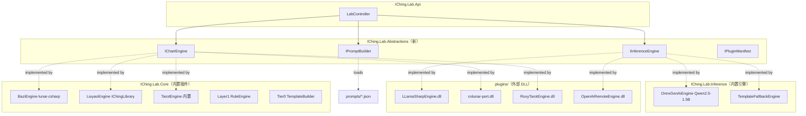
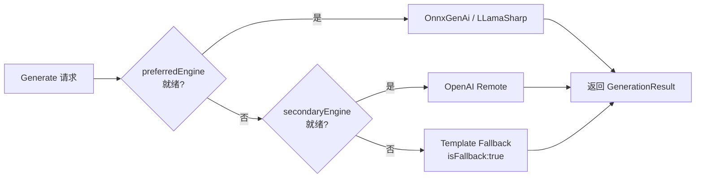

# 插件化设计调研：排盘算法 / Prompt Builder / 解读引擎

> **状态**：调研稿（仅文档，不动代码）
> **日期**：2026-07-03
> **范围**：将 `IChing.Lab.*` 三大耦合点抽象为可插拔接口，便于外部接入与替换
> **原则**：保持 [inference-layer-design.md](./inference-layer-design.md) 已锁定的「计算 deterministic，解读 generative」边界

---

## 1. 背景与动机

当前 Lab 已实现三域排盘 + ONNX 解读流水线，但三处关键能力均为**硬编码静态绑定**：

| 模块 | 现状 | 问题 |
|------|------|------|
| 排盘算法 ([BaziEngine](file:///workspace/src/IChing.Lab.Core/Bazi/BaziEngine.cs) / [LiuyaoNajiaService](file:///workspace/src/IChing.Lab.Core/Liuyao/LiuyaoNajiaService.cs) / [TarotEngine](file:///workspace/src/IChing.Lab.Core/Tarot/TarotEngine.cs)) | `static` 类，直接依赖 `lunar-csharp` / `IChingLibrary.SixLines` | 无法替换为 `cnlunar`、`ZhouYiLab`、`YiJingFramework` 等同生态实现 |
| Prompt Builder ([BaziPromptBuilder](file:///workspace/src/IChing.Lab.Inference/Prompts/BaziPromptBuilder.cs) 等) | `static` 类，模板字符串内联 | 改 prompt 需重新编译；无法按 tier / 客户 / 语言动态切换模板 |
| 解读引擎 ([ChartInterpretationService](file:///workspace/src/IChing.Lab.Inference/ChartInterpretationService.cs)) | 直接 `new Model/Tokenizer` (Microsoft.ML.OnnxRuntimeGenAI) | 无法切换 LLamaSharp / LM-Kit.NET / OpenAI 兼容远程 / 规则模板降级 |

目标：把这三层抽象为接口 + 注册机制，使「换排盘库」「换 Prompt 模板」「换推理后端」均可通过配置 + 拷贝 DLL 完成，无需改主程序。

---

## 2. 联网调研发现

### 2.1 命理算法库生态（可候选排盘插件）

#### 2.1.1 已在用

| 库 | 语言 | 协议 | 覆盖 | 备注 |
|----|------|------|------|------|
| [lunar-csharp](https://github.com/6tail/lunar-csharp) (6tail) | C# | MIT | 八字 / 黄历 / 节气 / 纳音 / 十神 / 胎元命宫身宫 / 起运 | 299★，多语言版本同步维护，0001–9999 年 |
| [IChingLibrary.SixLines](https://www.nuget.org/packages/IChingLibrary.SixLines/) 2.0.3 | C# (.NET 10) | — | 京房纳甲 / 世应 / 六亲 / 六神 / 16 神煞 / 卦属特性 | 已抽象 `ICastingMethod`，Builder 模式，本仓库已用 |

#### 2.1.2 可作为替代 / 补充插件

| 库 | 语言 | 协议 | 价值 |
|----|------|------|------|
| [YiJingFramework](https://www.nuget.org/packages/YiJingFramework.Annotating) 5.0.1 | C# (.NET 8) | MIT | 易学注解仓库结构，`Annotating.Zhouyi` 子包提供《周易》《易传》注解读写——可做塔罗/六爻牌义数据载体 |
| [cnlunar](https://pypi.org/project/cnlunar/) 0.2.4 | Python | MIT | 基于《钦定协纪辨方书》，宜忌等第表更严谨；可作"港式八字月柱算法"对照插件（需 Python 互操作或重写） |
| [ZhouYiLab](https://github.com/banderzhm/ZhouYiLab) | C++23 Modules | — | 大六壬 / 六爻 / 紫微 / 八字 / 奇门遁甲 五术齐全；模块化设计可作"扩展新术种"参考 |
| [ichingshifa](https://github.com/kentang2017/ichingshifa) | Python | — | 周易筮法 / 大衍之数 / 京房易 / 爻辭——可补 IChingLibrary 的爻辞解读 |
| [l2yao/iching](https://github.com/l2yao/iching) | Python | — | 八字 + 风水 + 六爻，有 JS 版本 |
| [horosa](https://awesome.ecosyste.ms/projects/github.com%2Fhorace-maxwell) | Mac App | — | 紫微 / 八字 / 占星 / 六壬 / 遁甲 / 太乙 / 六爻 / 统摄法 / 风水——产品形态参考 |

#### 2.1.3 塔罗数据源

| 库 / 数据集 | 形态 | 维度 | 价值 |
|----|------|------|------|
| [tarot-card-meanings](https://www.npmjs.com/package/tarot-card-meanings) (Deckaura) | NPM + PyPI | 12 维：upright / reversed / love / career / yesNo / keywords / element / planet / "how someone sees you" | 直接做 Tier 0 模板与小阿卡纳牌义库（[research-tarot-optimization.md](./research-tarot-optimization.md) Phase A 数据源） |
| [Deckaura 78 牌研究论文](https://cdn.shopify.com/s/files/1/0953/6195/8161/files/Tarot_Interpretation_Systems_Academic_Paper.pdf) | Kaggle / HuggingFace | 同上 + 元素分布统计 | 学术化牌义参考 |
| [Tarot MCP Server](https://lobehub.com/mcp/morax-tarot-mcp) (Morax) | Node.js / TS | 11 牌阵 + 自定义牌阵（1–15 位） | 牌阵扩展接口设计参考；元素平衡分析引擎可借鉴 |
| [RoxyAPI tarot](https://roxyapi.com/docs/tutorials/tarot-app) | 商业 API（含 C# SDK） | daily / three-card / yes-no / celtic-cross | 商业 API 形态参考，可作为远程排盘插件 |

### 2.2 AI 推理引擎生态（可候选解读插件）

| 引擎 | NuGet | 模型格式 | 优势 | 适合本项目的角色 |
|------|-------|----------|------|------------------|
| **Microsoft.ML.OnnxRuntimeGenAI**（已在用） | `Microsoft.ML.OnnxRuntimeGenAI` | ONNX + `genai_config.json` | 微软官方，与 .NET 10 深度集成，零外部依赖 | **默认引擎**，Qwen2.5-1.5B 已落地 |
| [LLamaSharp](https://github.com/SciSharp/LLamaSharp) 0.26.0 | `LLamaSharp` + `LLamaSharp.Backend.Cpu/Cuda12` | GGUF（Q4_K_S / Q5_K_M / Q8_0） | llama.cpp C# 绑定，支持 Llama3 / Phi / Mistral / Gemma3 / Qwen3，CPU/GPU/CUDA/Vulkan/Metal 全覆盖，与 Semantic Kernel / Kernel Memory 集成 | **次选引擎**，模型选择更丰富，可用 Qwen3-4B Q4 替代 1.5B 提质量 |
| [LM-Kit.NET](https://cloud.tencent.com.cn/developer/article/2690938) | 单 NuGet 包 | GGUF / ONNX / LMK | 全栈 SDK：推理 + Agent + RAG + 文档智能 + 56+ 内置工具，零外部依赖 | **进阶引擎**，将来做塔罗 RAG 知识库 / 多 Agent 编排时引入 |
| **Ollama / LMStudio** | HTTP 客户端 | GGUF | 用户友好，OpenAI 兼容 API | **不推荐**：[实测比 llama.cpp 慢 70%](https://www.banandre.com/blog/llamacpp-vs-ollama-performance-divide-local-llm-runtimes)，且 Qwen3.5 时代 tool calling 不稳定 |
| **OpenAI 兼容远程**（[OpenAiChatClient](file:///workspace/src/IChing.Desktop/OpenAiChatClient.cs) 已实现） | HTTP | 远程 | 无本地资源消耗，质量上限高 | **远程引擎**，桌面端 / 付费 Tier 2 用 |

#### 2.2.1 关键趋势（2026 Q2）

1. **Qwen3.5 时代 llama.cpp > Ollama**：`presence_penalty` / `frequency_penalty` 参数 Ollama 静默忽略，导致输出重复
2. **本地小模型质量已足够**：Qwen3.5-4B Apache 2.0，0.8B / 2B / 4B / 9B 全档位
3. **GGUF 生态成熟**：HuggingFace 直接拉 Unsloth 量化版即可跑
4. **.NET 9/10 ONNX 零依赖**：`OnnxModel.Load()` 一行加载，启动 ~45ms（vs NuGet 方案 ~120ms）

### 2.3 .NET 插件化机制（实现依据）

| 机制 | 状态 | 适用 |
|------|------|------|
| **`AssemblyLoadContext` + `AssemblyDependencyResolver`** | 官方推荐（[MS Learn](https://learn.microsoft.com/dotnet/core/tutorials/creating-app-with-plugin-support)） | 主选方案，支持 `isCollectible: true` 卸载，依赖隔离 |
| **MEF / MEF2** | [社区共识：不再推荐](https://www.devleader.ca/2026/04/09/plugin-loading-in-net-assemblyloadcontext-with-dependency-injection) | 不采用，DI 集成更现代 |
| **`Assembly.LoadFrom`** | 旧式，依赖冲突高发 | 不采用 |
| **AppDomain** | .NET Core 后已不支持隔离加载 | 不采用 |

**安全提示**（来自 MS Learn）：不可信代码**不能**安全加载到 .NET 进程内；如需沙箱，应使用 OS 级虚拟化或进程隔离。本项目插件均为自有/可信来源，ALC 方案足够。

---

## 3. 设计目标

| # | 目标 | 验收 |
|---|------|------|
| G1 | 排盘算法可替换 | 切换 `lunar-csharp` ↔ `cnlunar-port` 不改 LabController |
| G2 | Prompt 模板可热配 | 改 `prompts/*.json` 即生效，无需重编译 |
| G3 | 解读引擎可切换 | `appsettings.json` 改 `engine: llama-sharp` 即切到 LLamaSharp |
| G4 | 三层互不耦合 | 排盘插件不知道 Inference 存在，反之亦然 |
| G5 | 配置驱动注册 | `plugins:` 配置段声明启用哪些插件，DI 容器解析 |
| G6 | 降级链一致 | 任何引擎不可用时回落到模板，`isFallback: true` 标记不变 |

---

## 4. 三对象插件化方案

### 4.1 总体架构



### 4.2 对象一：排盘算法 `IChartEngine`

#### 4.2.1 接口抽象

```csharp
public interface IChartEngine
{
    string Domain { get; }        // "bazi" | "liuyao" | "tarot" | "calendar" | ...
    string EngineId { get; }      // "lunar-csharp-1.6.8" | "cnlunar-0.2.4" | "roxy-tarot-v2"
    object Calculate(ChartRequest request);
}

public abstract record ChartRequest(string Domain, IDictionary<string, object?> Args);
```

- `Domain` 决定路由（与现有 `/lab/{domain}` 对齐）
- `EngineId` 写入 `engine.paipan` 字段，便于审计
- `Calculate` 返回值沿用各域现有 `BaziChart` / `LiuyaoNajiaResult` / `TarotReading`（向下兼容）

#### 4.2.2 注册策略

按 `Domain` 维度注册多个实现，配置选定默认 + 备用：

```json
"plugins": {
  "chartEngines": [
    { "id": "lunar-csharp", "domain": "bazi",    "default": true },
    { "id": "cnlunar-port", "domain": "bazi",    "default": false },
    { "id": "iching-sixlines", "domain": "liuyao", "default": true },
    { "id": "roxy-tarot",     "domain": "tarot", "default": false, "assembly": "plugins/RoxyTarotEngine.dll" }
  ]
}
```

### 4.3 对象二：Prompt Builder `IPromptBuilder`

#### 4.3.1 接口抽象

```csharp
public interface IPromptBuilder
{
    string Domain { get; }
    int Tier { get; }              // 1 | 2
    string TemplateId { get; }     // "bazi-tier1-default" | "bazi-tier1-v2" | "tarot-tier1-en"
    PromptBuildResult Build(PromptContext ctx);
}

public sealed record PromptContext(
    object Chart,
    object? RuleDigest,
    string? Question,
    string? Focus,
    int MaxTokens);

public sealed record PromptBuildResult(
    string PromptText,
    string? EngineHint,            // null | "qwen-legacy-zh" | "qwen-english"
    bool NeedsTranslationPass);    // 塔罗 → true
```

#### 4.3.2 模板外置化

把 [BaziPromptBuilder](file:///workspace/src/IChing.Lab.Inference/Prompts/BaziPromptBuilder.cs) 等的硬编码字符串移到 `prompts/{domain}-tier{N}-{variant}.txt`，使用 [Scriban](https://github.com/scriban/scriban) 模板引擎：

```
prompts/
├── bazi-tier1-default.txt
├── bazi-tier1-v2.txt
├── bazi-tier2-yongshen.txt
├── bazi-tier2-dongbian.txt
├── liuyao-tier1-default.txt
├── tarot-tier1-en.txt
└── tarot-tier2-celtic-cross.txt
```

模板示例（`bazi-tier1-default.txt`）：

```scriban
{{ system }}
你是八字解读助手。四柱与大运由系统计算，请勿修改干支。
不要编造未提供的流年、年份、应期或具体日期。
{{ end }}

{{ user }}
关注：{{ focus | default "综合" }}
规则摘要：
{{ rule_digest }}

命盘：
{{ chart_json }}

请用简体中文写一段不超过 {{ word_max | default 400 }} 字简析。
{{ end }}
```

#### 4.3.3 热加载

- 启动时扫描 `prompts/` 目录构建字典
- `IFileWatcher` 监听变更，触发 `IPromptBuilderRegistry.Reload(domain, tier)`
- Tier 0 模板不走此机制（在 [Tier0 TemplateBuilder](file:///workspace/src/IChing.Lab.Core/Readings/ReadingSummaries.cs) 内，规则模板）

### 4.4 对象三：解读引擎 `IInferenceEngine`

#### 4.4.1 接口抽象

```csharp
public interface IInferenceEngine : IDisposable
{
    string EngineId { get; }       // "onnx-genai-qwen2.5-1.5b" | "llama-sharp-qwen3-4b" | "openai-remote" | "template-fallback"
    bool IsReady { get; }
    Task<GenerationResult> GenerateAsync(string prompt, GenerateOptions options, CancellationToken ct);
}

public sealed record GenerateOptions(
    int MaxTokens = 512,
    string? EngineHint = null,
    float? Temperature = null,
    int? TopK = null,
    float? TopP = null);
```

- 现有 [ChartInterpretationService](file:///workspace/src/IChing.Lab.Inference/ChartInterpretationService.cs) 拆成 `OnnxGenAiEngine`（核心逻辑保留）+ `ChartInterpretationOrchestrator`（编排 + 降级链）
- 塔罗英译中两 pass 由 Orchestrator 编排：Pass1 调 `engine.GenerateAsync` → Pass2 调翻译 prompt 再调一次

#### 4.4.2 降级链



`GenerateOptions.EngineHint` 提示优先引擎，Orchestrator 按配置链回退。

#### 4.4.3 候选引擎实现

| EngineId | 程序集 | 依赖 | 适用 tier |
|----------|--------|------|-----------|
| `onnx-genai-qwen2.5-1.5b` | IChing.Lab.Inference（内置） | `Microsoft.ML.OnnxRuntimeGenAI` | 1 / 2 |
| `llama-sharp-qwen3-4b` | plugins/LLamaSharpEngine.dll | `LLamaSharp` + `LLamaSharp.Backend.Cpu` | 1 / 2 |
| `openai-remote` | plugins/OpenAiRemoteEngine.dll | HTTP（已有 [OpenAiChatClient](file:///workspace/src/IChing.Desktop/OpenAiChatClient.cs)） | 2（桌面端付费档） |
| `template-fallback` | IChing.Lab.Inference（内置） | 无 | 0 / 降级 |

---

## 5. 加载机制

### 5.1 AssemblyLoadContext 方案

```csharp
public sealed class PluginLoadContext : AssemblyLoadContext
{
    private readonly AssemblyDependencyResolver _resolver;
    public PluginLoadContext(string mainAssemblyPath) : base(isCollectible: true)
        => _resolver = new AssemblyDependencyResolver(mainAssemblyPath);

    protected override Assembly? Load(AssemblyName name)
    {
        var path = _resolver.ResolveAssemblyToPath(name);
        return path is null ? null : LoadFromAssemblyPath(path);
    }

    protected override IntPtr LoadUnmanagedDll(string name)
    {
        var path = _resolver.ResolveUnmanagedDllToPath(name);
        return path is null ? IntPtr.Zero : LoadUnmanagedDllFromPath(path);
    }
}
```

- 每个外部插件独立 ALC，避免 `Microsoft.ML.OnnxRuntimeGenAI` 与 `LLamaSharp.Backend.Cuda12` 的 native DLL 冲突
- 卸载流程：清引用 → `Unload()` → `GC.Collect()` → `GC.WaitForPendingFinalizers()` → `GC.Collect()`
- **共享接口**：`IChing.Lab.Abstractions` 编译为独立 DLL，插件仅引用此 DLL，主程序也引用——`Load()` 返回 `null` 让接口落到 default context，保证类型同一

### 5.2 DI 集成

```csharp
// Program.cs
var pluginSection = builder.Configuration.GetSection("plugins");
var loader = new PluginLoader(pluginSection);

foreach (var manifest in loader.Discover())
{
    var asm = loader.LoadAssembly(manifest);
    var types = asm.GetTypes()
        .Where(t => typeof(IPluginModule).IsAssignableFrom(t) && !t.IsAbstract);

    foreach (var t in types)
    {
        var instance = (IPluginModule)ActivatorUtilities.CreateInstance(
            builder.Services.BuildServiceProvider(), t);
        instance.Register(builder.Services);
    }
}
```

每个插件实现 `IPluginModule.Register(IServiceCollection)` 自行注册到 DI。

### 5.3 配置 Schema

```json
{
  "plugins": {
    "chartEngines": [
      { "id": "lunar-csharp", "domain": "bazi", "default": true },
      { "id": "iching-sixlines", "domain": "liuyao", "default": true },
      { "id": "iching-tarot", "domain": "tarot", "default": true }
    ],
    "inferenceEngines": [
      { "id": "onnx-genai-qwen2.5-1.5b", "default": true, "modelPath": "./models/qwen2.5-1.5b-genai" },
      { "id": "llama-sharp-qwen3-4b", "modelPath": "./models/qwen3-4b-q4_k_s.gguf", "gpuLayerCount": 0 },
      { "id": "openai-remote", "baseUrl": "https://api.openai.com/v1", "model": "gpt-4o-mini" }
    ],
    "promptBuilders": {
      "templateRoot": "./prompts",
      "variants": [
        { "domain": "bazi",  "tier": 1, "templateId": "bazi-tier1-default" },
        { "domain": "tarot", "tier": 1, "templateId": "tarot-tier1-en", "needsTranslation": true }
      ]
    },
    "fallbackChain": ["onnx-genai-qwen2.5-1.5b", "openai-remote", "template-fallback"],
    "externalAssemblies": [
      { "name": "LLamaSharpEngine", "path": "plugins/LLamaSharpEngine.dll" },
      { "name": "OpenAiRemoteEngine", "path": "plugins/OpenAiRemoteEngine.dll" }
    ]
  }
}
```

---

## 6. 实施路线图

| 阶段 | 内容 | 风险 |
|------|------|------|
| **P1** | 新建 `IChing.Lab.Abstractions` 项目，定义 `IChartEngine` / `IPromptBuilder` / `IInferenceEngine` / `IPluginModule` 四接口 | 低，纯抽象 |
| **P2** | 把 `ChartInterpretationService` 拆为 `OnnxGenAiEngine` + `ChartInterpretationOrchestrator`，保持现有 API 行为 | 中，需保留塔罗两 pass 编排 |
| **P3** | 把 `BaziEngine` 等包装为 `IChartEngine` 实现，注册到 DI | 低，原 static 方法仍可调用 |
| **P4** | Prompt 模板外置到 `prompts/*.txt`，引入 Scriban | 中，需迁移现有 3 个 PromptBuilder |
| **P5** | 实现 `PluginLoader` + `PluginLoadContext`，DI 集成 | 中，native DLL 依赖冲突需测试 |
| **P6** | 编写示例外部插件 `LLamaSharpEngine` | 高，GGUF 模型下载与 CUDA backend 选择需平台测试 |
| **P7** | 配置 schema + 热加载 + 卸载测试 | 中，GC 卸载时机需验证 |

每阶段保持 [inference-layer-design.md](./inference-layer-design.md) 的 Phase 路线不变；本插件化路线与之并行，不冲突。

---

## 7. 风险与对策

| 风险 | 对策 |
|------|------|
| ONNX native DLL 与 LLamaSharp native DLL 冲突 | 各放独立 ALC；`LoadUnmanagedDll` 走 `AssemblyDependencyResolver` |
| 插件版本与主程序接口不匹配 | `IPluginManifest` 含 `RequiredApiVersion`，启动校验 |
| 模板热加载破坏一致性 | 模板加载失败时回退到内置默认模板，记日志 |
| 远程引擎 API key 泄露 | 配置走 `IConfiguration` + User Secrets；不入仓 |
| 卸载时 native 资源未释放 | `IInferenceEngine` 实现 `IDisposable`，卸载前显式 `Dispose` |
| 排盘插件语义不一致（如 cnlunar 月柱算法差异） | `EngineId` 写入响应，前端展示「按 X 库排盘」 |

---

## 8. 与现有文档的关系

- **不替代** [inference-layer-design.md](./inference-layer-design.md)：分层（Layer1 / Tier / 英译中）逻辑保持
- **不替代** [tech-stack-dotnet.md](./tech-stack-dotnet.md)：技术栈仍是 .NET 10
- **补充** [mvp-backend.md](./mvp-backend.md)：Java Spike 中的 `BaziCalculator` 接口设计理念可借鉴到 `IChartEngine`
- **承接** [onnx-models-survey.md](./onnx-models-survey.md)：模型选型属于 `IInferenceEngine` 实现细节

---

## 9. 参考资料

### 命理算法库
- [lunar-csharp (6tail, GitHub)](https://github.com/6tail/lunar-csharp)
- [IChingLibrary.SixLines (NuGet)](https://www.nuget.org/packages/IChingLibrary.SixLines/)
- [YiJingFramework.Annotating (NuGet)](https://www.nuget.org/packages/YiJingFramework.Annotating)
- [cnlunar (PyPI)](https://pypi.org/project/cnlunar/)
- [ZhouYiLab (GitHub)](https://github.com/banderzhm/ZhouYiLab)
- [ichingshifa (GitHub)](https://github.com/kentang2017/ichingshifa)
- [tarot-card-meanings (NPM)](https://www.npmjs.com/package/tarot-card-meanings)
- [Tarot MCP Server (LobeHub)](https://lobehub.com/mcp/morax-tarot-mcp)
- [RoxyAPI tarot tutorial](https://roxyapi.com/docs/tutorials/tarot-app)
- [Deckaura 78 牌研究论文 (DOI 10.5281/zenodo.19152918)](https://cdn.shopify.com/s/files/1/0953/6195/8161/files/Tarot_Interpretation_Systems_Academic_Paper.pdf)

### AI 推理引擎
- [LLamaSharp (GitHub)](https://github.com/SciSharp/LLamaSharp)
- [Running Local AI with LlamaSharp in .NET (C# Corner)](https://www.c-sharpcorner.com/article/running-local-ai-with-llamasharp-in-net-a-developers-guide/)
- [LM-Kit.NET (腾讯云)](https://cloud.tencent.com.cn/developer/article/2690938)
- [Running AI On-Prem with Phi-3 / Llama 3 in .NET](https://developersvoice.com/blog/ai-development/running-ai-on-prem/)
- [Llama.cpp on Windows 11 with Qwen 3.5](https://developersvoice.com/blog/ai-development/llamacpp-qwen35-claude-code-windows-guide/)
- [llama.cpp vs Ollama: 70% Performance Divide](https://www.banandre.com/blog/llamacpp-vs-ollama-performance-divide-local-llm-runtimes)
- [Developers Advised to Use llama.cpp vLLM SGLang for Qwen3.5](https://www.thenextgentechinsider.com/pulse/developers-advised-to-use-llamacpp-vllm-sglang-for-qwen35-local-inference)
- [C# 本地部署 Qwen3.5-27B 三种姿势](https://blog.csdn.net/jiangjunshow/article/details/158422413)

### .NET 插件化
- [Create a .NET Core application with plugins (MS Learn)](https://learn.microsoft.com/dotnet/core/tutorials/creating-app-with-plugin-support)
- [How to use and debug assembly unloadability (MS Learn)](https://learn.microsoft.com/dotnet/standard/assembly/unloadability)
- [Plugin Loading in .NET: AssemblyLoadContext with DI (devleader.ca)](https://www.devleader.ca/2026/04/09/plugin-loading-in-net-assemblyloadcontext-with-dependency-injection)
- [基于 AssemblyLoadContext 的 .NET 插件化架构设计 (CSDN)](https://blog.csdn.net/weixin_48916144/article/details/159240781)

---

*文档版本：v0.1 调研稿 · 与 [inference-layer-design.md](./inference-layer-design.md) 同步维护*
