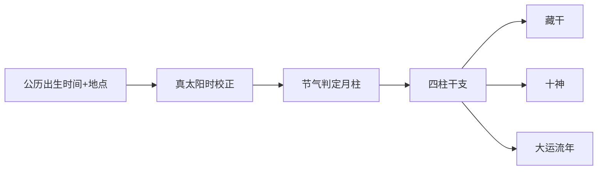
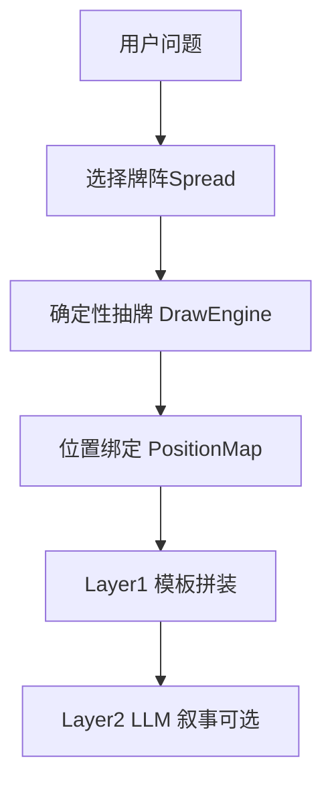

# 排盘算法调研：八字、六爻、塔罗

> 本文档用于 **IChing 项目调研**，不构成最终产品规格。  
> 竞品分析材料不入库。

---

## 1. 八字（BaZi）实现要点

### 1.1 计算流水线



### 1.2 核心难点

| 环节 | 说明 | 常见坑 |
|------|------|--------|
| **月柱** | 以节气为界，非农历初一 | 出生在节气前后 1 天必校验 |
| **时柱** | 子时跨日（早子/晚子） | 各派规则不同，需产品定规 |
| **真太阳时** | `标准时 + 经度修正 + 均时差` | 仅用北京时间会错时辰 |
| **大运** | 顺逆由性别+年干阴阳决定 | 起运岁数需精确到节气 |

**真太阳时公式**（业界通用）：

```text
真太阳时 = 标准时 + (本地经度 - 时区中央经线) × 4分钟 + 均时差(EOT)
```

### 1.3 可参考开源实现

| 项目 | 语言 | 能力 | 链接 |
|------|------|------|------|
| **lunar-csharp** | C# | 农历、八字、十神、纳音、节气 | [NuGet](https://www.nuget.org/packages/lunar-csharp) / [GitHub](https://github.com/6tail/lunar-csharp) |
| **MingPan** | TypeScript | 八字/六爻/梅花/奇门等纯计算 | [GitHub](https://github.com/Jam0731/MingPan) |
| **bazi-tool** | Python | 节气(ephem)、真太阳时、大运、刑冲合害 | [GitHub](https://github.com/reed1898/bazi-tool) |
| **apparent_solar_time** | Rust | 真太阳时 + 中国历史夏令时 | [GitHub](https://github.com/ZhengjunHUO/apparent_solar_time) |
| **true-solar-time** | TypeScript | Jean Meeus 均时差 | [GitHub](https://github.com/look-fate/true-solar-time) |
| **ChineseCalendarLib** | C# | 双语万年历 + 八字 | [GitHub](https://github.com/livedcode/ChineseCalendarLib) |

**Lab 当前接入**：`lunar-csharp`（`src/IChing.Lab.Core/Bazi/BaziEngine.cs`）。  
**待补**：真太阳时、晚子时规则、大运流年。

---

## 2. 六爻（Liuyao）实现要点

### 2.1 铜钱法（概率模型）

三枚铜钱，字面=2（阴）、背面=3（阳），总和映射：

| 总和 | 名称 | 阴阳 | 动爻 | 概率 |
|------|------|------|------|------|
| 6 | 老阴 | 阴 | 变阳 | 1/8 |
| 7 | 少阳 | 阳 | 否 | 3/8 |
| 8 | 少阴 | 阴 | 否 | 3/8 |
| 9 | 老阳 | 阳 | 变阴 | 1/8 |

**错误实现**：`random() < 0.5` 直接生成阴阳 — 会破坏动爻分布，专业用户可感知。

掷 6 次得初爻→上爻，动爻产生**变卦**。

### 2.2 时间卦 / 数字卦（确定性）

梅花易数常见：

- 上卦 = `(年+月+日) mod 8`，余 0 取 8（坤）
- 下卦 = `(年+月+日+时) mod 8`
- 动爻 = `(年+月+日+时) mod 6`，余 0 取 6（上爻）

年月日时通常取**农历干支数**或固定编码表，不同门派有差异。

### 2.3 装卦后续（生产级）

铜钱/时间卦只得到本卦与变卦。完整六爻还需：

1. **纳甲** — 卦爻配天干地支
2. **世应** — 八宫卦世爻位置
3. **六亲** — 五行生克映射
4. **六神** — 按日干起青龙等
5. **神煞** — 驿马、桃花等

**.NET 参考**：[IChingLibrary](https://github.com/TheodoreCheung/IChingLibrary)（六爻完整实现，依赖 lunar-csharp）。

**Lab 当前**：`LiuyaoEngine` 实现铜钱概率 + 简化时间卦，**未做纳甲六亲**。

---

## 3. 塔罗（Tarot）算法逻辑

### 3.1 与易学排盘的差异

| 维度 | 八字/六爻 | 塔罗 |
|------|----------|------|
| 输入 | 出生时间 / 起卦动作 | 问题 + 牌阵类型 |
| 随机性 | 铜钱有固定分布；时间卦可确定 | 洗牌 + 正逆位 |
| 输出结构 | 干支、爻位、六亲 | 牌 + 位置语义 |
| 解读 | 规则推导为主 | 牌义模板 + 叙述合成 |

### 3.2 推荐三层架构



1. **数据层**：78 张牌（正/逆位释义）、牌阵 schema（位置名 + 语义上下文）
2. **抽牌层**：Fisher-Yates 洗牌 + 可选 `seed`（可复现，便于测试与分享）
3. **解读层**：
   - Layer 1：按 `position.rag_mapping` 取牌义片段拼装（无幻觉）
   - Layer 2：ONNX/云端 LLM 将多卡语境合成叙事

### 3.3 开源参考

| 项目 | 说明 |
|------|------|
| [arcanite](https://github.com/katelouie/arcanite) | 11 种牌阵 + RAG 映射 + 可选 LLM |
| [TarotSchema/codex](https://github.com/TarotSchema/codex) | 牌/牌阵机器可读 schema |
| [RoxyAPI 数据模型](https://roxyapi.com/blogs/tarot-data-model-cards-spreads-readings) | spread + seed + positions 设计 |

**Lab 当前**：78 张牌 + 3 种牌阵（含 Celtic Cross），`seed` 可复现；小阿卡纳为模板拼接，无牌面图像。

> 详细优化调研见 [`docs/research-tarot-optimization.md`](research-tarot-optimization.md)。

### 3.4 可增强逻辑（后续）

- **元素关系**（火水土风）：相邻牌生克修饰释义权重
- **牌阵级叙事**：过去→现在→未来时态一致性检查
- **问题分类**：感情/事业/决策 → 选择不同牌阵与 prompt 模板
- **小阿卡纳逐张释义、牌面图像、会话缓存、牌组模板**：见优化调研文档

---

## 4. AI 解读与排盘的关系

| 场景 | 是否用大模型 | 说明 |
|------|-------------|------|
| 四柱干支计算 | 否 | 必须确定性算法 |
| 铜钱起卦 | 否 | 概率/规则 |
| 深度报告文案 | 是 | 结构化命盘 JSON → LLM |
| 塔罗 Layer2 | 是 | 模板片段 → LLM 叙事 |

**原则**：**计算 deterministic，解读 generative**。命盘 JSON 作为 LLM 输入，避免让模型「算干支」。

---

## 5. 调研结论与下一步

1. **.NET 正式栈**：Core 纯算法 + Api 探针，逐步替换 Java Spike。
2. **八字**：继续用 lunar-csharp，补真太阳时（可移植 `true-solar-time` 逻辑到 C#）。
3. **六爻**：评估直接引用或移植 IChingLibrary 纳甲体系。
4. **塔罗**：见 [`docs/research-tarot-optimization.md`](research-tarot-optimization.md)（P0 洗牌修正 → P1 牌义/图像 → P2 牌阵/会话）。
5. **ONNX**：见 `docs/onnx-models-survey.md`，用于解读层而非排盘。
